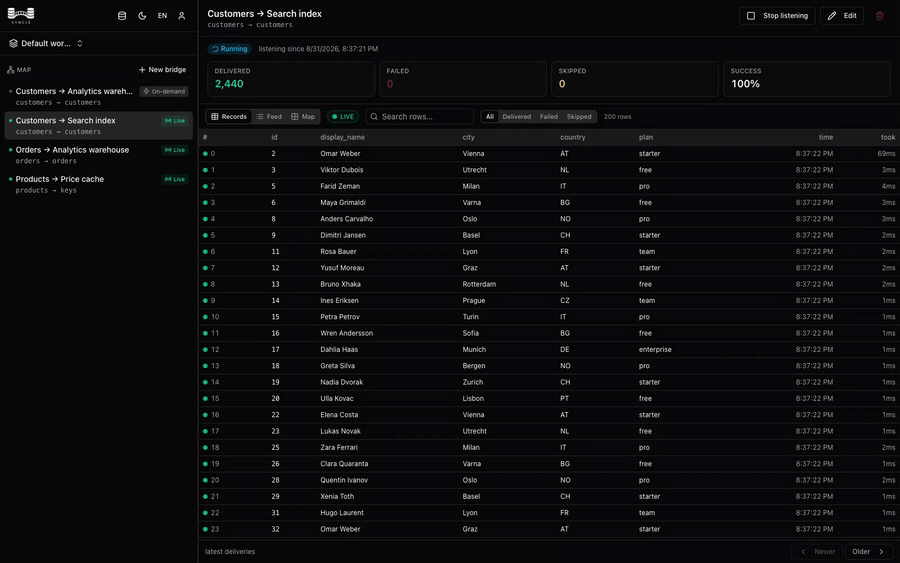
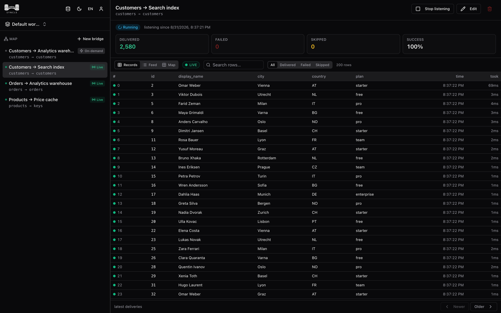
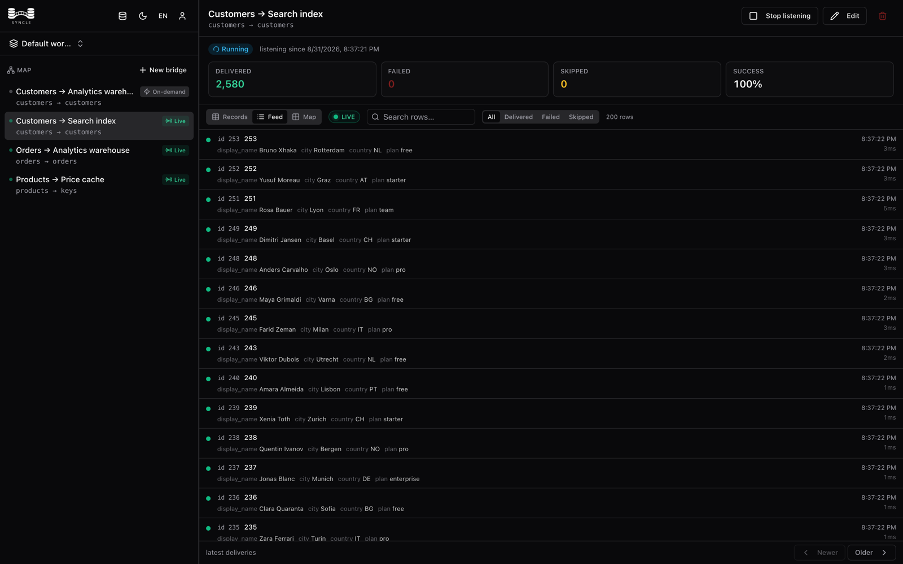
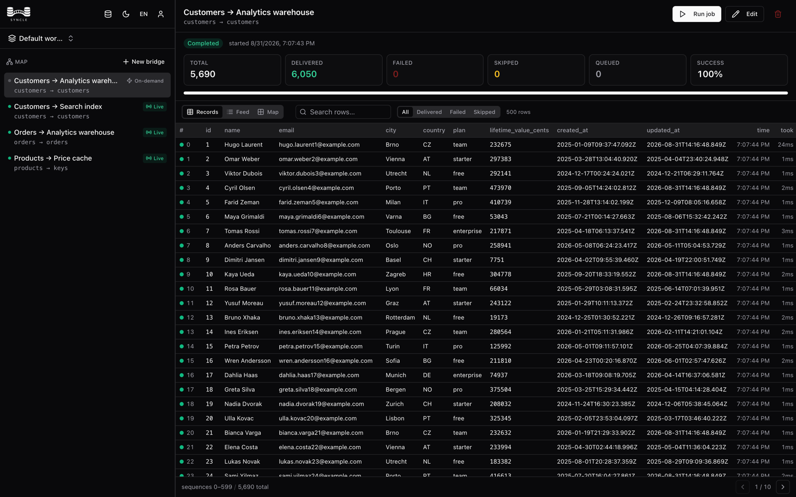
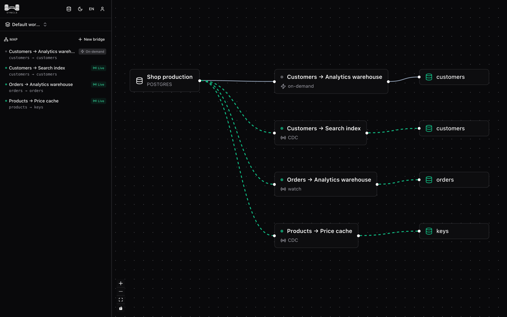
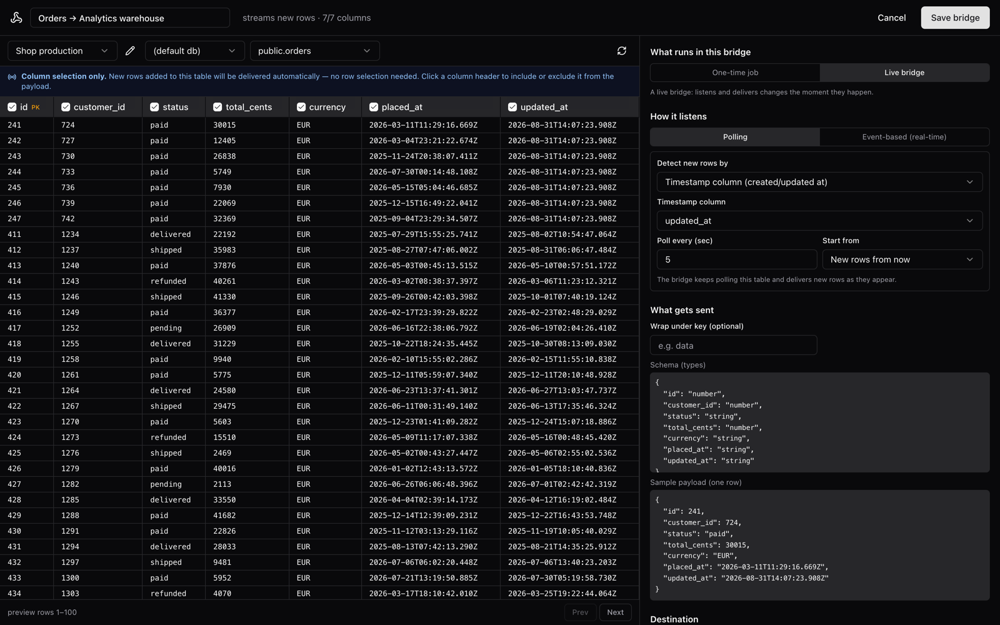
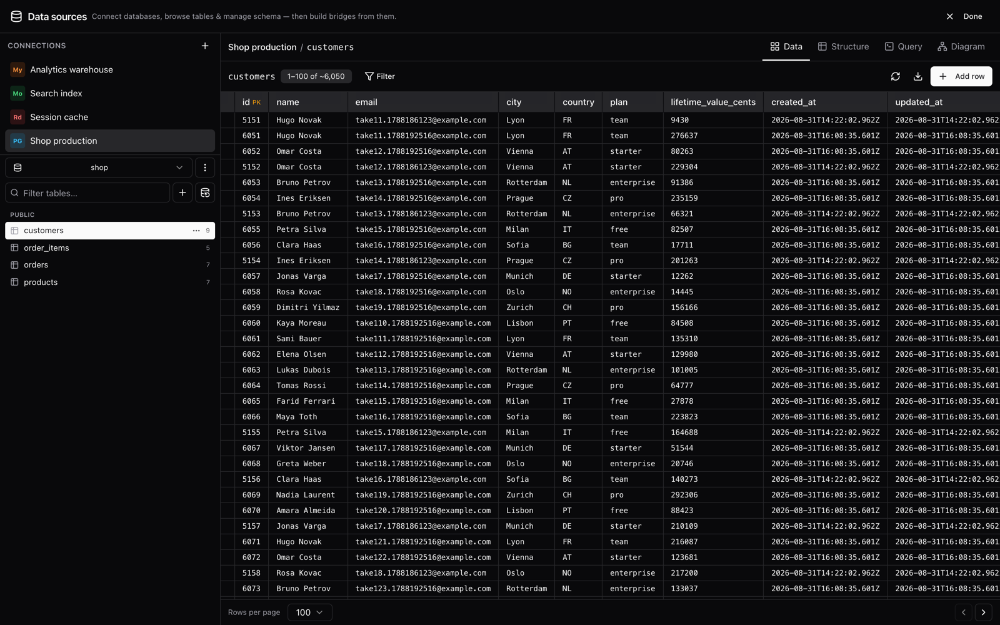
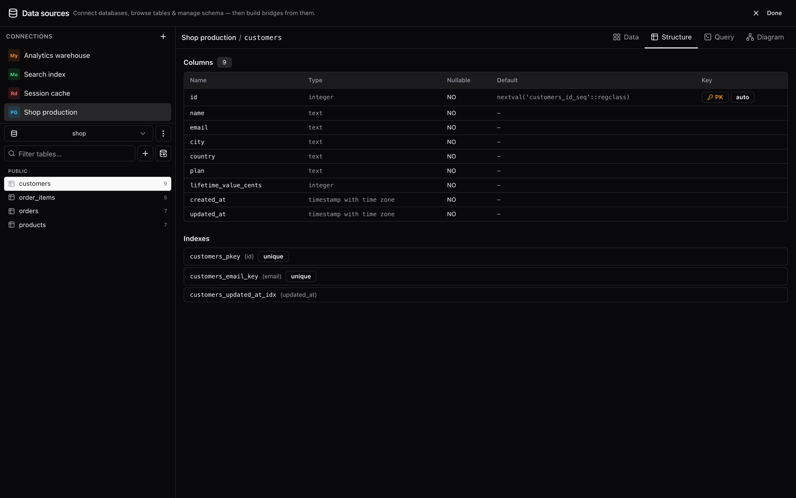
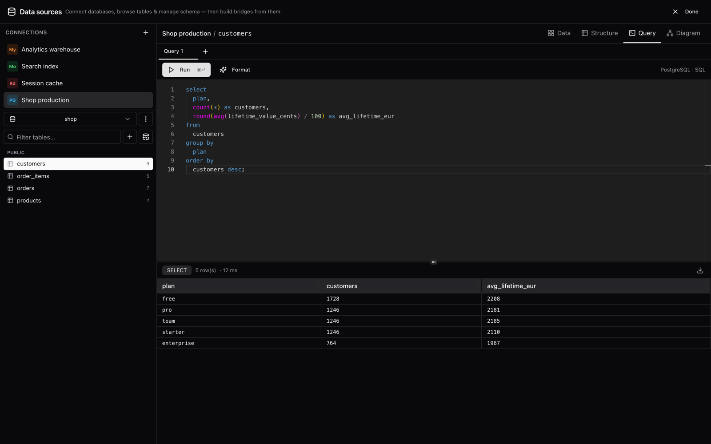
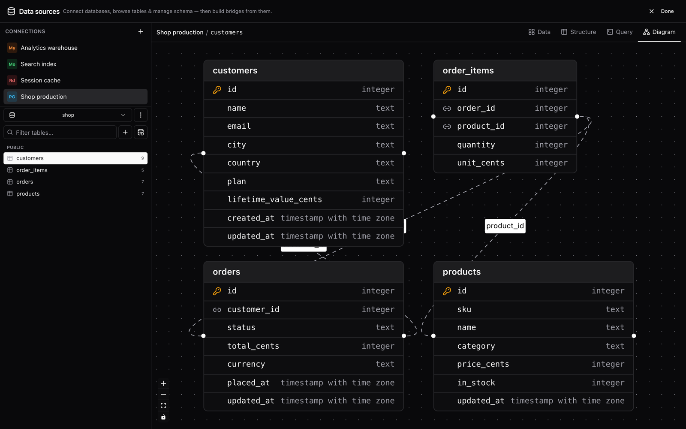

# Product media

Captured from a running Syncle instance on 31 August 2026 — not mock-ups.

A throwaway stack was stood up alongside four live databases, seeded with a
generated shop (4,820 customers, 19,400 orders, 640 products, 41,200 order
items), and four bridges were built and left running: a completed replay
backfill into MySQL, a CDC bridge into MongoDB, a watch bridge polling
`updated_at`, and a CDC bridge warming a Redis price cache. Every number on
screen is a real delivery count from that run.

Nothing here is anyone's data. Names are assembled from common name parts and
every address is on `example.com`, the reserved domain.

Images are 1600px wide — twice the width they are usually displayed at, so they
stay sharp on high-density screens without carrying 3200px files in git.

---

## Motion

**`syncle-live-sync.gif`** — 12 s · 900px · 2.2 MB. The moment that matters, on
a loop: the delivered counter climbing as rows land. Used at the top of the
project README, where a GIF plays and an MP4 does not.

**`syncle-demo.mp4`** — 46 s · 1600×1000 · 2.8 MB. [The full run](syncle-demo.mp4):
the workspace map, opening a live CDC bridge, rows inserted into Postgres
arriving while you watch, the feed, then those same rows sitting in MongoDB.
For the website, a Show HN post, or social. The inserts are fired from outside
the browser while the page is open, so the counter moving on screen is the
bridge actually working — no cuts, nothing sped up.

---

## Stills

### `01-bridge-live-cdc.png` — a live CDC bridge

The hero. Running, 100% success, and the rows that crossed it. **In the README.**

### `02-bridge-feed.png` — the same deliveries as a stream

Newest first, one line per row. An alternate hero, and good for the docs.

### `03-bridge-backfill.png` — a completed replay

5,690 rows, zero failures, per-row timings. **In the README**, next to the
delivery guarantees.

### `04-workspace-map.png` — the whole product in one image

One source fanning out to four bridges and four destinations. The best single
image for the website.

### `05-bridge-builder.png` — building a bridge

Column selection, a live preview of the source rows, trigger configuration, the
inferred schema and a sample payload. For the website's "build it visually"
section and `docs/bridges`.

### `06-workbench-data.png` — browsing a table

5,060 rows with the schema tree beside them. **In the README**, in the workbench
section.

### `07-workbench-structure.png` — columns, keys and indexes

For `docs/workbench`.

### `08-workbench-query.png` — the SQL editor

A real result set in 11 ms. For the website's workbench section.

### `09-workbench-diagram.png` — the ER diagram

Foreign keys drawn between the four tables. **In the README**, and good for the
website.

---

## Re-shooting after a UI change

The capture is scripted — a compose file for the four databases and a separate
Syncle instance, a seed SQL file, and Playwright scripts that drive the real UI
and wait on real text before each frame, so a slow render cannot produce an
empty screenshot. They live outside this repo today; say the word and they can
land under `scripts/demo/` so re-shooting is one command.
